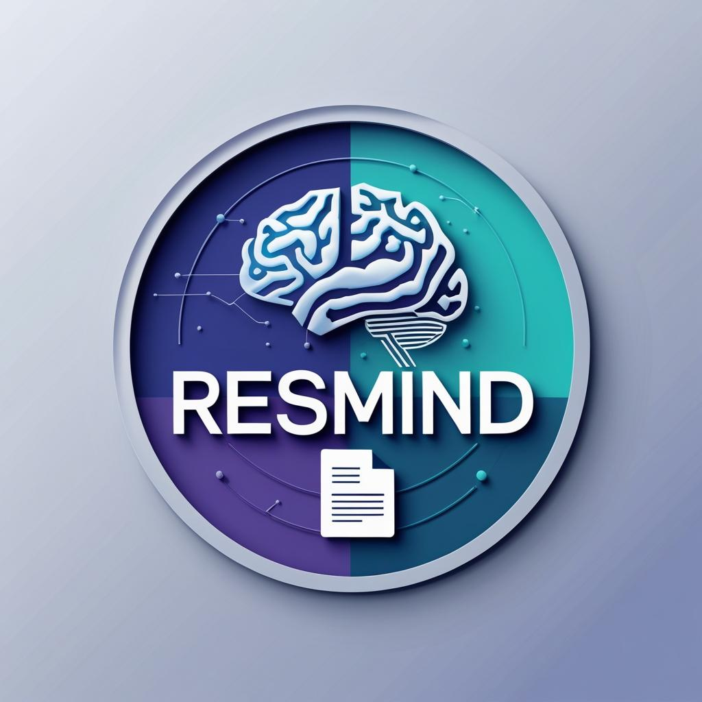

Here’s a complete and professional **`README.md`** file for your ResMind project — ready to upload on **GitHub**:

---

## 🧠 ResMind – AI Resume Analyzer & MNC Predictor



ResMind is an AI-powered resume analyzer that predicts **which MNC company** is most likely to hire a candidate based on their **resume content** and **desired job role**. It also provides a **salary estimation** and a breakdown of resume sections.

---

### 🚀 Features

* 📎 **Resume Upload** (.pdf)
* 💼 **Select Job Role** from dropdown (Data Scientist, ML Engineer, etc.)
* 🏢 **Top MNC Prediction** (based on resume skills & keywords)
* 💰 **Salary Range Estimation**
* 📄 **Section-wise Resume Overview**
* 🧼 Clean & Responsive UI (HTML/CSS)
* ⚡ Loader while processing
* 📱 Mobile Friendly Layout
* 🖼️ Custom Logo & Branding

---

### 📁 Folder Structure

```
ResMind/
│
├── static/
│   ├── style.css         # All CSS styling
│   └── logo.png          # Your ResMind logo
│
├── templates/
│   └── index.html        # Frontend layout
│
├── app.py                # Main Flask backend
└── README.md             # This file
```

---

### ⚙️ How It Works

1. **User uploads their resume (PDF)**
2. **Selects a target job role** from the dropdown
3. Backend:

   * Parses the resume
   * Matches keywords from the job description
   * Scores and predicts likely company and salary
4. **Results** are displayed instantly in the UI

---

### 🛠️ Tech Stack

* **Frontend**: HTML, CSS, 
* **Backend**: Python, Flask


---

###  Setup Instructions

1. **Clone this repo**

```bash
git clone https://github.com/yourusername/resmind.git
cd resmind
```

2. **Create & activate virtual environment**

```bash
python -m venv venv
source venv/bin/activate   # On Windows: venv\Scripts\activate
```

3. **Install requirements**

```bash
pip install -r requirements.txt
```

4. **Run the app**

```bash
python app.py
```

5. **Open in browser**

```
http://127.0.0.1:5000
```

---

### 📸 Screenshots

> Include screenshots here showing:
>
> * Upload UI
> * MNC prediction result
> * Salary prediction
> * Section summary

---

### 🤖 Future Upgrades

* 🔄 Downloadable PDF report
* 🌓 Dark Mode toggle
* 📊 Visual resume score radar chart
* 📝 Job Description Custom Editor
* 🌐 Host on Hugging Face or Render

---

### 🙌 Contributing

Open to suggestions, pull requests, and feature ideas!

---

### 📧 Contact

Made with 💙 by \[SHAIK TAHIR HUSSAIN]
[LinkedIn](https://www.linkedin.com/in/tahir-hussain-516447306/) 
[GitHub](https://github.com/tahir-014)


